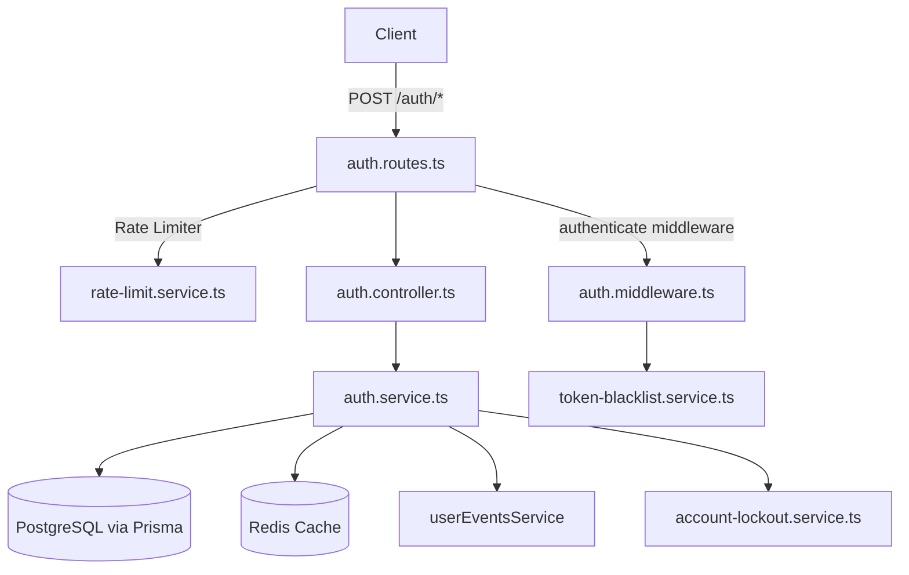

# Authentication System — coorad-backend

## Architecture Overview



---

## Token Strategy: Dual JWT + Cookie

| Token | Storage | Transport | Purpose |
|-------|---------|-----------|---------|
| **Access Token** | In-memory (client) | `Authorization: Bearer` header | Short-lived auth for protected routes |
| **Refresh Token** | `httpOnly` cookie | Automatic with requests | Long-lived session renewal |

- Access tokens embed a **`jti` (UUID)** for blacklisting support after logout.
- Refresh tokens are **hashed (SHA-256)** before being stored in the DB and Redis.

---

## Flow 1 — Registration

```
POST /auth/register
 └─ validate body (Zod)
 └─ check existing user → block if already verified
 └─ hash password (bcrypt)
 └─ generate 6-digit verification code + expiry
 └─ upsert user in DB (allows re-registration for unverified accounts)
 └─ invalidate any stale Redis cache for that email
 └─ emit UserRegistered event → sends verification email
 └─ set `registration_verification` httpOnly cookie (base64-encoded email)
 └─ respond 201
```

---

## Flow 2 — Email Verification

```
POST /auth/verify-email
 └─ read email from `registration_verification` cookie
 └─ validate verification code (Zod)
 └─ look up user → check: exists, not already verified, code not expired, code matches
 └─ update user: isVerified=true, clear code fields
 └─ invalidate auth user cache
 └─ clear `registration_verification` cookie
 └─ respond 200
```

> Resend: `POST /auth/resend-email-verification` — regenerates code, refreshes cookie.

---

## Flow 3 — Password Reset (3-step)

```
Step 1: POST /auth/request-password-reset
 └─ generate new code + expiry → update DB
 └─ emit PasswordResetRequested event → sends email
 └─ set `password_reset_verification` cookie

Step 2: POST /auth/verify-password-reset
 └─ read email from `password_reset_verification` cookie
 └─ verify code (same checks as email verification)
 └─ clear code from DB (consumed after verification)
 └─ swap cookie: clear verification → set `password_reset_session` cookie

Step 3: POST /auth/reset-password
 └─ read email from `password_reset_session` cookie
 └─ hash new password → update DB
 └─ delete ALL refresh tokens for this user (DB transaction)
 └─ invalidate Redis: user cache + all refresh token cache
 └─ emit PasswordResetSuccess event
 └─ clear `password_reset_session` cookie
```

> Resend: `POST /auth/resend-password-reset-verification`

---

## Flow 4 — Login

```
POST /auth/login
 └─ check account lockout (by email + IP) → throw LoginBlockedError if blocked
 └─ fetch user from Redis cache or DB
 └─ if not found → record failed attempt → throw 401
 └─ compare password (bcrypt)
 └─ if wrong → record failed attempt → throw 401
 └─ if not verified → throw 403
 └─ record successful login (clears lockout counters)
 └─ sign access token (short-lived, with jti)
 └─ sign refresh token (long-lived)
 └─ hash refresh token → store in DB + Redis
 └─ set `refresh_token` httpOnly cookie
 └─ respond 200 with { accessToken }
```

### Account Lockout Policy (Redis)

| Target | Max Failures | Window | Lockout Duration |
|--------|-------------|--------|-----------------|
| Account (by email) | 5 | 15 min | 30 min |
| IP address | 20 | 15 min | 30 min |

> Fails open: if Redis is unreachable, login is allowed through.

---

## Flow 5 — Token Refresh (Rotation)

```
POST /auth/refresh-token
 └─ read refresh token from httpOnly cookie
 └─ verify JWT signature → throw 401 if invalid
 └─ hash token → look up in Redis cache or DB
 └─ if not found or expired → throw 401
 └─ look up user by decoded ID
 └─ atomic DB transaction:
     ├─ delete old refresh token (by id + hash + userId — prevents race conditions)
     └─ create new refresh token
 └─ invalidate old token cache → cache new token
 └─ sign new access + refresh tokens
 └─ replace httpOnly cookie with new refresh token
 └─ respond 200 with { accessToken }
```

> **Single-use rotation**: each refresh token is consumed atomically. Reuse of a spent token fails immediately.

---

## Flow 6 — Logout

```
POST /auth/logout  (requires authenticate middleware)
 └─ read refresh token from cookie → delete from DB
 └─ invalidate ALL refresh token cache for this user (prefix scan)
 └─ extract access token from Authorization header
 └─ decode jti + exp → blacklist jti in Redis with remaining TTL
 └─ clear `refresh_token` cookie
 └─ respond 200
```

---

## Auth Middleware

### `authenticate` — Required Auth
- Extracts `Authorization: Bearer <token>` header.
- Verifies JWT signature via `verifyAccessToken`.
- Checks `tokenBlacklistService.isBlacklisted(jti)` — fails open if Redis is down.
- Attaches `{ id, email, role }` to `req.user`.

### `optionalAuthenticate` — Optional Auth
- Same as above but silently falls through if no token is present.
- Used for endpoints with different behavior for logged-in vs. guest users.

### `authorize(...roles)` — RBAC
- Factory that restricts access to specific roles.
- Must be used **after** `authenticate`.

---

## Redis Cache Keys

| Key Pattern | Purpose | TTL |
|-------------|---------|-----|
| `cache:auth:user:entity:{userId}` | Full auth user entity | 300s |
| `cache:auth:user:lookup:email:{email}` | Email → userId lookup | 300s |
| `cache:user:entity:{userId}` | Safe (public) user entity | 300s |
| `cache:auth:refresh:user:{userId}:entity:{tokenId}` | Refresh token entity | Token expiry |
| `cache:auth:refresh:user:{userId}:lookup:{hash}` | Hash → tokenId lookup | Token expiry |
| `blacklist:{jti}` | Blacklisted access token JTI | Remaining token TTL |
| `lockout:account:attempts:{email}` | Failed login counter | 15 min window |
| `lockout:account:blocked:{email}` | Account blocked flag | 30 min |
| `lockout:ip:attempts:{ip}` | IP failure counter | 15 min window |
| `lockout:ip:blocked:{ip}` | IP blocked flag | 30 min |

---

## Rate Limiters (per route)

| Route | Limiter |
|-------|---------|
| `/register` | `registerRateLimiter` |
| `/verify-email`, `/verify-password-reset` | `verifyCodeRateLimiter` |
| `/resend-*` | `resendRateLimiter` |
| `/request-password-reset`, `/reset-password` | `passwordResetRateLimiter` |
| `/login` | `loginRateLimiter` |
| `/refresh-token` | `refreshTokenRateLimiter` |
| `/logout` | `logoutRateLimiter` |

---

## Security Notes

- **Email enumeration protection**: resend & password-reset endpoints always return success regardless of whether the email exists.
- **Verification code security**: stored as plaintext in DB; expired by TTL checked server-side (`isCodeExpired`).
- **Cookie settings**: `httpOnly`, `sameSite: strict`, `secure` in production.
- **Password reset invalidates all sessions**: resetting password wipes all refresh tokens.
- **No state leakage**: `SafeUserEntity` strips password and verification fields before caching for public use.
